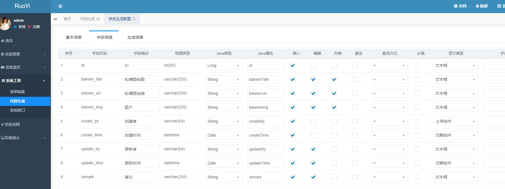
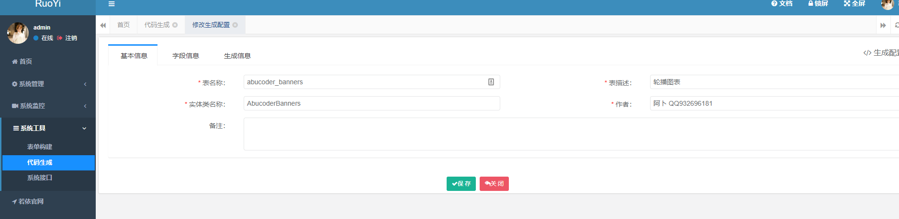
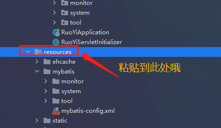

# 最新微信小程序登录授权认证接口及其他接口完整项目（UniApp版）

## 简介


#### 这是一套前后端一起的脚手架，省去了好多需要写的东西，开箱即用,声明：此版基于Ruoyi-Fast前后端不分离版本哦，如果需要前后端分离板（多模块）请前往https://gitee.com/rahman/AbuCoder-RuoYi-Vue-uniapp-wx
一直想做一款基于若依后台管理系统的微信小程序，最近比较闲了，所以想做个简单的东西。主要为了学习，走一遍整个过程，也是为像我这种小白提供些简单的学习内容。
喜欢的话可以给个赞赏，谢谢~

若依是一套全部开源的快速开发平台，毫无保留给个人及企业免费使用。

### 前后端分离板后端
#### 基于Ruoyi-Vue的版本上线，记得给个star，谢谢
- 开源地址：https://gitee.com/rahman/AbuCoder-RuoYi-Vue-uniapp-wx
- 后端在线体验：https://ga.rasmall.cn


* 感谢若依后端开发框架，本项目使用的是Ruoyi-fast单体版，可以体现下载下来
* 连接地址是 https://gitee.com/y_project/RuoYi-fast

## 基于Ruoyi-Fast版本使用方法
1. 下载全部代码 https://gitee.com/rahman/abu-coder-ruoyi-uniapp-wx
2. 把UniApp代码Ruoyi-AbuCoder-UniApp-WX导入到HbuilderX
3. 修改小程序代码里的接口地址，在Utils——>apiconfig.js->baseUrl
4. 申请微信小程序AppId和密钥
5. 把后端代码导入到IntelliJ IDEA(前提是你已经搭建好Java1.8,MySQL5.7,Maven3.6等环境)
6. 修改WxloginController里的微信小程序AppId和密钥
7. 启动你的后端代码，注意我这个默认接口为8080
8. 测试前段
9. 继续开发你自己的逻辑
### QQ交流群：<a href="https://jq.qq.com/?_wv=1027&k=T2nwpddM" target="_blank">228763221</a>
## 小程序扫码体验

## 后端体验地址
https://abucoder.rasmall.cn/
## 使用UniApp准备前段


## 开始搭建
*此处忽略了你环境搭建以及若依框架下载部署
### 第一步创建数据库


```mysql
CREATE TABLE `ruoyi_abucoder_uniappwx`.`abucoder_banners`  (
`id` int(20) NOT NULL AUTO_INCREMENT COMMENT 'ID',
`banner_title` varchar(255) CHARACTER SET utf8mb4 COLLATE utf8mb4_general_ci NULL DEFAULT NULL COMMENT '轮播图标题',
`banner_url` varchar(255) CHARACTER SET utf8mb4 COLLATE utf8mb4_general_ci NULL DEFAULT NULL COMMENT '轮播图连接',
`banner_img` varchar(255) CHARACTER SET utf8mb4 COLLATE utf8mb4_general_ci NULL DEFAULT NULL COMMENT '图片',
`create_by` varchar(64) CHARACTER SET utf8mb4 COLLATE utf8mb4_general_ci NULL DEFAULT '' COMMENT '创建者',
`create_time` datetime(0) NULL DEFAULT NULL COMMENT '创建时间',
`update_by` varchar(64) CHARACTER SET utf8mb4 COLLATE utf8mb4_general_ci NULL DEFAULT '' COMMENT '更新者',
`update_time` datetime(0) NULL DEFAULT NULL COMMENT '更新时间',
`remark` varchar(255) CHARACTER SET utf8mb4 COLLATE utf8mb4_general_ci NULL DEFAULT NULL COMMENT '备注',
PRIMARY KEY (`id`) USING BTREE
) ENGINE = InnoDB AUTO_INCREMENT = 1 CHARACTER SET = utf8mb4 COLLATE = utf8mb4_general_ci COMMENT = '轮播图表' ROW_FORMAT = Dynamic;
CREATE TABLE `ruoyi_abucoder_uniappwx`.`abucoder_items`  (
`id` int(20) NOT NULL AUTO_INCREMENT COMMENT 'ID',
`item_name` varchar(255) CHARACTER SET utf8mb4 COLLATE utf8mb4_general_ci NULL DEFAULT NULL COMMENT '项目名称',
`item_desc` varchar(255) CHARACTER SET utf8mb4 COLLATE utf8mb4_general_ci NULL DEFAULT NULL COMMENT '项目介绍',
`item_content` varchar(2048) CHARACTER SET utf8mb4 COLLATE utf8mb4_general_ci NULL DEFAULT NULL COMMENT '项目内容',
`create_by` varchar(64) CHARACTER SET utf8mb4 COLLATE utf8mb4_general_ci NULL DEFAULT '' COMMENT '创建者',
`create_time` datetime(0) NULL DEFAULT NULL COMMENT '创建时间',
`update_by` varchar(64) CHARACTER SET utf8mb4 COLLATE utf8mb4_general_ci NULL DEFAULT '' COMMENT '更新者',
`update_time` datetime(0) NULL DEFAULT NULL COMMENT '更新时间',
`remark` varchar(255) CHARACTER SET utf8mb4 COLLATE utf8mb4_general_ci NULL DEFAULT NULL COMMENT '备注',
PRIMARY KEY (`id`) USING BTREE
) ENGINE = InnoDB AUTO_INCREMENT = 1 CHARACTER SET = utf8mb4 COLLATE = utf8mb4_general_ci COMMENT = '推荐项目表' ROW_FORMAT = Dynamic;

CREATE TABLE `ruoyi_abucoder_uniappwx`.`abucoder_programs`  (
`id` int(20) NOT NULL AUTO_INCREMENT COMMENT 'ID',
`program_name` varchar(255) CHARACTER SET utf8mb4 COLLATE utf8mb4_general_ci NULL DEFAULT NULL COMMENT '项目名称',
`program_tag` varchar(20) CHARACTER SET utf8mb4 COLLATE utf8mb4_general_ci NULL DEFAULT NULL COMMENT '标签',
`program_img` varchar(255) CHARACTER SET utf8mb4 COLLATE utf8mb4_general_ci NULL DEFAULT NULL COMMENT '图片',
`program_content` varchar(2048) CHARACTER SET utf8mb4 COLLATE utf8mb4_general_ci NULL DEFAULT NULL COMMENT '项目介绍',
`create_by` varchar(64) CHARACTER SET utf8mb4 COLLATE utf8mb4_general_ci NULL DEFAULT '' COMMENT '创建者',
`create_time` datetime(0) NULL DEFAULT NULL COMMENT '创建时间',
`update_by` varchar(64) CHARACTER SET utf8mb4 COLLATE utf8mb4_general_ci NULL DEFAULT '' COMMENT '更新者',
`update_time` datetime(0) NULL DEFAULT NULL COMMENT '更新时间',
`remark` varchar(255) CHARACTER SET utf8mb4 COLLATE utf8mb4_general_ci NULL DEFAULT NULL COMMENT '备注',
PRIMARY KEY (`id`) USING BTREE
) ENGINE = InnoDB AUTO_INCREMENT = 2 CHARACTER SET = utf8mb4 COLLATE = utf8mb4_general_ci COMMENT = '推荐开源项目表' ROW_FORMAT = Dynamic;

CREATE TABLE `ruoyi_abucoder_uniappwx`.`abucoder_wxuser`  (
`id` int(20) NOT NULL AUTO_INCREMENT COMMENT 'ID',
`nickname` varchar(100) CHARACTER SET utf8mb4 COLLATE utf8mb4_general_ci NULL DEFAULT NULL COMMENT '微信名称',
`avatar` varchar(255) CHARACTER SET utf8mb4 COLLATE utf8mb4_general_ci NULL DEFAULT NULL COMMENT '头像',
`openid` varchar(100) CHARACTER SET utf8mb4 COLLATE utf8mb4_general_ci NULL DEFAULT NULL COMMENT '微信唯一标识符',
`gender` int(1) NULL DEFAULT NULL COMMENT '性别',
`create_by` varchar(64) CHARACTER SET utf8mb4 COLLATE utf8mb4_general_ci NULL DEFAULT '' COMMENT '创建者',
`create_time` datetime(0) NULL DEFAULT NULL COMMENT '创建时间',
`update_by` varchar(64) CHARACTER SET utf8mb4 COLLATE utf8mb4_general_ci NULL DEFAULT '' COMMENT '更新者',
`update_time` datetime(0) NULL DEFAULT NULL COMMENT '更新时间',
`remark` varchar(255) CHARACTER SET utf8mb4 COLLATE utf8mb4_general_ci NULL DEFAULT NULL COMMENT '备注',
PRIMARY KEY (`id`) USING BTREE
) ENGINE = InnoDB AUTO_INCREMENT = 1 CHARACTER SET = utf8mb4 COLLATE = utf8mb4_general_ci COMMENT = '微信用户表' ROW_FORMAT = Dynamic;

```
### 第二步开始生成代码
1. 我们要代码生成前需要先建立我们自业务的菜单

2. 导入我们需要生成的四个表

3. 编辑我们要生成的功能（我这里就一张表为介绍了，其他都是一样的操作了）





### 第三步开始导入生成的代码
1. 导入到IDEA中测试



2. 此时我们已经生成后的代码都导入到我们的IDEA里了，现在可以测试下了


3. 重新启动IDEA之前一定要先Rbuild Project重新编译下，要不然出现404

4. 启动登录后我们发现我们的功能都正常了


5. 

### 第四步开始写微信接口并测试Api
1. 首先要放心我们需要做的Api路径
```java
filterChainDefinitionMap.put("/wxapi/**", "anon");//放行微信请求的所有接口地址
filterChainDefinitionMap.put("/profile/**", "anon");//放行微信请求的所有图片接口地址
```

2. 编写我们的微信登录授权接口

#### 登录接口代码如下
```java
/**
 * author：AbuCoder QQ:932696181
 * 微信小程序登录授权接口
 * Gitee:https://gitee.com/rahman
 */
@RestController
@RequestMapping("/wxapi")
public class WxloginController {

    @Autowired
    IAbucoderWxuserService iAbucoderWxuserService;

    @Autowired
    private ServerConfig serverConfig;
    /**
     * 你自己的微信小程序APPID
     */
    private final static String AppID = "你自己的微信小程序APPID";
    /**
     * 你自己的微信APP密钥
     */
    private final static String AppSecret = "你自己的微信APP密钥";

    /**
     * 登录时获取的 code（微信官方提供的临时凭证）
     * @param object
     * @return
     */
    @PostMapping("/wxlogin")
    public AjaxResult wxLogin(@RequestBody JSONObject object){
        //微信官方提供的微信小程序登录授权时使用的URL地址
        String url  = "https://api.weixin.qq.com/sns/jscode2session";
        System.out.println(object);

        /**
         * 拼接需要的参数
         * appid = AppID 你自己的微信小程序APPID
         * js_code = AppSecret 你自己的微信APP密钥
         * grant_type=authorization_code = code 微信官方提供的临时凭证
         */
        String params = StrUtil.format("appid={}&secret={}&js_code={}&grant_type=authorization_code", AppID, AppSecret, object.get("code"));
        //开始发起网络请求,若依管理系统自带网络请求工具，直接使用即可
        String res = HttpUtils.sendGet(url,params);
        JSONObject jsonObject = JSON.parseObject(res);
        String openid = (String) jsonObject.get("openid");
        if (StrUtil.isEmpty(openid)) {
            return AjaxResult.error("未获取到openid");
        }
        /**先通过openid来查询是否存在*/
        AbucoderWxuser abucoderWxuser = iAbucoderWxuserService.selectAbucoderWxuserOpenID(openid);
        if (abucoderWxuser == null){
            /**如果不存在就插入到我们的数据库里*/
            AbucoderWxuser  wxuser = new AbucoderWxuser();
            wxuser.setOpenid(openid);
            wxuser.setCreateTime(DateUtils.getNowDate());
            iAbucoderWxuserService.insertAbucoderWxuser(wxuser);
        }
        /**返回结果集到前段*/
        return AjaxResult.success(abucoderWxuser);
    }

    @PostMapping("/upload")
    @ResponseBody
    public AjaxResult uploadFile(MultipartFile file) throws Exception
    {
        System.out.println(file);
        try
        {
            // 上传文件路径
            String filePath = RuoYiConfig.getUploadPath();
            // 上传并返回新文件名称
            String fileName = FileUploadUtils.upload(filePath, file);
            String url = serverConfig.getUrl() + fileName;
            AjaxResult ajax = AjaxResult.success();
            ajax.put("url", url);
            ajax.put("fileName", fileName);
            ajax.put("newFileName", FileUtils.getName(fileName));
            ajax.put("originalFilename", file.getOriginalFilename());
            return ajax;
        }
        catch (Exception e)
        {
            return AjaxResult.error(e.getMessage());
        }
    }

    /**
     * 保存昵称与头像信息到用户信息里
     * @param object
     * @return
     */
    @PostMapping("/saveUserInfo")
    @ResponseBody
    public AjaxResult saveUserInfo(@RequestBody JSONObject object){
        System.out.println(object);
        AbucoderWxuser abucoderWxuser = iAbucoderWxuserService.selectAbucoderWxuserOpenID(String.valueOf(object.get("openid")));
        if (StringUtils.hasLength(String.valueOf(object.get("nickName")))){
            abucoderWxuser.setNickname(String.valueOf(object.get("nickName")));
            abucoderWxuser.setCreateBy(String.valueOf(object.get("nickName")));
        }
        if (StringUtils.hasLength(String.valueOf(object.get("avatarUrl")))){
            abucoderWxuser.setAvatar(String.valueOf(object.get("avatarUrl")));
        }
        abucoderWxuser.setUpdateTime(DateUtils.getNowDate());
        iAbucoderWxuserService.updateAbucoderWxuser(abucoderWxuser);
        //返回前段需要的数据
        return AjaxResult.success(abucoderWxuser);
    }
}
```
3. 在后端页面查看数据

4. 其他接口同理
* 1.轮播图接口代码及演示
* java代码
```java
/**
 * author：AbuCoder QQ:932696181
 * 微信小程序获取轮播图接口
 * Gitee:https://gitee.com/rahman
 */
@RestController
@RequestMapping("/wxapi")
public class WxBannerController {

    @Autowired
    IAbucoderBannersService iAbucoderBannersService;
    @GetMapping("/loadBaneer")
    public AjaxResult loadBaneer(AbucoderBanners abucoderBanners){
        List<AbucoderBanners> bannerslist = iAbucoderBannersService.selectAbucoderBannersList(abucoderBanners);
        return AjaxResult.success(bannerslist);
    }
}
```
* 前段代码
```javascript

getBannerlist(){
    this.request('loadBaneer', 'GET').then(res=>{
        console.log("res:",res)
        if(res){
            this.bannerList = res.data
        }
    })
},
```
* 2.通知公告接口代码及演示
* java接口代码
```java
/**
 * author：AbuCoder QQ:932696181
 * 微信小程序获取通知公告接口
 * Gitee:https://gitee.com/rahman
 */
@RestController
@RequestMapping("/wxapi")
public class WxNoticeController {

    @Autowired
    INoticeService iNoticeService;
    @GetMapping("/loadNotice")
    public AjaxResult loadNotice(){
        List<Notice> notices = iNoticeService.selectAllNotice();
        return AjaxResult.success(notices);
    }
}
```
* 前段代码
```javascript
getNoticelist(){
    this.request('loadNotice', 'GET').then(res=>{
        console.log("res:",res)
        if(res){
            this.messageData = res.data
        }
    })
},
```
* 3.推荐小程序接口代码及演示
* java接口代码
```java
/**
 * author：AbuCoder QQ:932696181
 * 微信小程序获取推荐小程序接口
 * Gitee:https://gitee.com/rahman
 */
@RestController
@RequestMapping("/wxapi")
public class WxItemsController {

    @Autowired
    IAbucoderItemsService iAbucoderItemsService;
    @GetMapping("/loadItems")
    public AjaxResult loadItems(AbucoderItems abucoderItems){
        List<AbucoderItems> itemslist = iAbucoderItemsService.selectAbucoderItemsList(abucoderItems);
        return AjaxResult.success(itemslist);
    }
}

```
* 前段代码
```javascript
getItemslist(){
    this.request('loadItems', 'GET').then(res=>{
        console.log("res:",res)
        if(res){
            this.curriculum = res.data
        }
    })
},
```
* 4.推荐开源项目接口代码及演示
* java接口代码
```java
/**
 * author：AbuCoder QQ:932696181
 * 微信小程序获取推荐项目接口
 * Gitee:https://gitee.com/rahman
 */
@RestController
@RequestMapping("/wxapi")
public class WxProgramController {

    @Autowired
    IAbucoderProgramsService iAbucoderProgramsService;
    @GetMapping("/loadProgramms")
    public AjaxResult loadProgramms(AbucoderPrograms abucoderPrograms){
        List<AbucoderPrograms> programmslist = iAbucoderProgramsService.selectAbucoderProgramsList(abucoderPrograms);
        return AjaxResult.success(programmslist);
    }
}
```
* 前段代码
```javascript
getProgrammslist(){
    this.request('loadProgramms', 'GET').then(res=>{
        console.log("res:",res)
        if(res){
            this.projectList = res.data
        }
    })
}
```